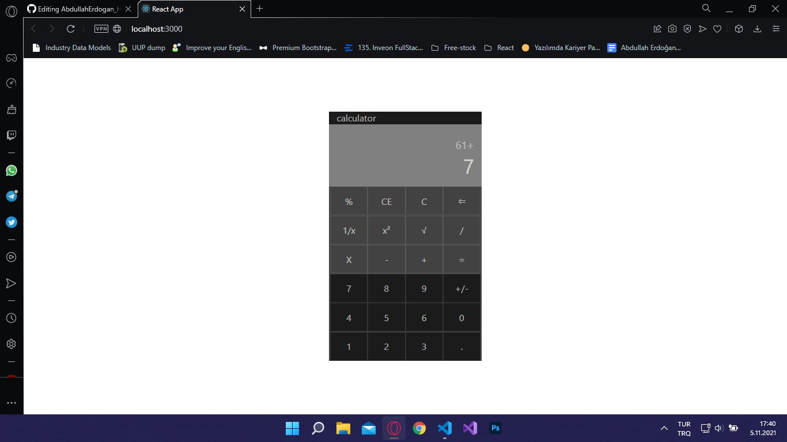

## Calculator Project

in this project I tried create a calculator with react

> [Go Live](https://618545804e5def00abdf4b94--brave-goldwasser-01215e.netlify.app)

## Image

## Available Scripts

In the project directory, you can run:

### `yarn start`

Runs the app in the development mode.\
Open [http://localhost:3000](http://localhost:3000) to view it in the browser.

The page will reload if you make edits.\
You will also see any lint errors in the console.
